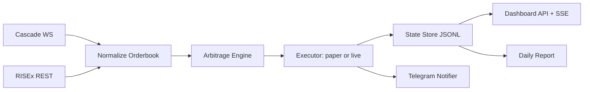

# Architecture

## Overview

The system is a single Node.js service with four layers:

1. Exchange adapters normalize Cascade WebSocket and RISEx REST APIs into a common orderbook and order interface. A mock adapter is available for local smoke tests.
2. The arbitrage engine evaluates BTC and ETH two-leg opportunities in both directions.
3. Executors apply safety policy. `paper` mode records simulated delta-neutral fills. `live` mode is gated and sends IOC-style paired orders through adapters.
4. The dashboard, Telegram notifier, and daily report read from the same state store.

Live trading is disabled unless both `TRADING_MODE=live` and `TRADING_ENABLED=true`.

## Folder Structure

```text
src/
  clients/        Exchange-specific REST clients and orderbook normalization
  core/           Arbitrage evaluation, execution, engine loop, risk checks
  lib/            Config, HTTP, logging, math helpers
  reports/        Daily PnL/report generation
  server/         HTTP API, SSE, static dashboard
  main.js         Process entry point
public/           Dashboard HTML, CSS, browser JS
docs/
  exchanges/      Local exchange API notes
test/             Node test runner unit tests
```

## Data Flow



## Edge Cases

- Stale orderbook: the engine skips a symbol when either venue book is older than `STALE_BOOK_MS`.
- Empty or crossed local book: malformed levels are ignored; impossible opportunities are rejected.
- Shallow liquidity: executable size is found with a binary search over full-depth VWAP, not just top of book.
- One-leg failure in live mode: live executor records the failed pair, pauses the engine, and sends an alert so the position can be manually repaired or handled by a future hedge module.
- Daily loss breach: engine pauses when realized daily PnL is below `-MAX_DAILY_LOSS_USD`.
- Position imbalance: paper state tracks per-symbol venue exposure and refuses opportunities that would exceed `MAX_POSITION_USD_PER_SYMBOL`.
- Missing credentials: adapters raise explicit configuration errors; paper mode continues without live credentials.
- Unknown exchange route during onboarding: keep `TRADING_MODE=paper` until live orderbook data, balances, alerts, and paper fills are validated.

## Error Management

- HTTP calls use timeout and retry with exponential backoff.
- Every tick emits an event with either opportunities, skips, or errors.
- State changes are appended to JSONL before being exposed to the dashboard.
- Telegram failures are logged but do not crash the trading loop.
- Unhandled process errors are logged and cause a clean non-zero exit.

## Performance Evaluation

The hot path is O(symbols * depth * log(maxNotional)) because each direction uses a small binary search over orderbook depth. With BTC and ETH, depth 20, and a 2.5s loop, the CPU cost is negligible on a laptop. Network latency dominates. Cascade is already read through WebSocket; for lower latency production, keep persistent orderbook streams for both venues instead of polling snapshots.
